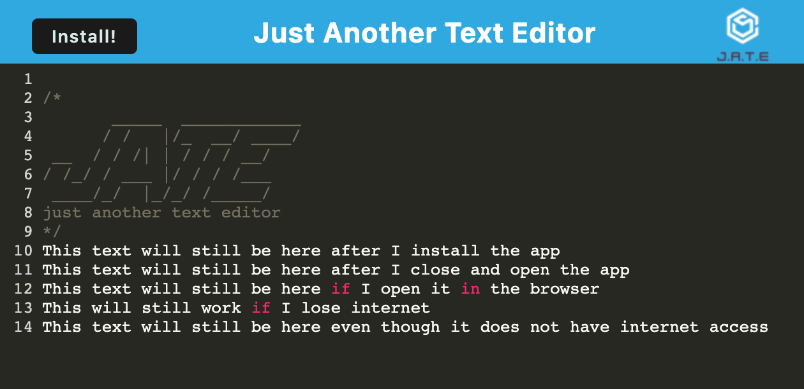

# text-editor
[](./LICENSE)
## Description
This is a PWA text editor the can be installed and used offline. Built with Express and Webpack.

## User Story
```
As a developer, I want to create notes or code snippets with or without an internet connection so that I can reliably retrieve them for later use.
```

## Table of Contents
- [Installation](#installation)
- [Usage](#usage)
- [Link](#link)
- [License](#license)
- [Features](#features)
- [Tests](#tests)
- [Questions](#questions)

## Installation
- To get the app on your local machine:
  1. Click on the code button on the repo.
  2. Copy the HTTPS or SSH link.
  3. Run the command `git clone` with the copied HTTPS or SSH link.
- To get the app prepared to run, in the terminal, run the command `npm i`.

## Usage
The visual shows the app running on the heroku deployed server.



Please click [here](https://youtu.be/oGBPFoPZ2FQ) for a video demo.

## Link
https://andrewbyoo-text-editor.herokuapp.com/

## License
This application is covered under the MIT license.

## Features
- Installable application
- Ability to use the app without internet connection

## Tests
When starting the app on a local machine, the command `npm run start` was run to start the app.

The app was installed and cut off from internet access and the editor saved changes as intended.

## Questions
To view more of my projects, you can visit my GitHub page at [andrewbyoo](https://github.com/andrewbyoo).

If you have questions, email me at [andrewbyoo@gmail.com](mailto:andrewbyoo@gmail.com).
